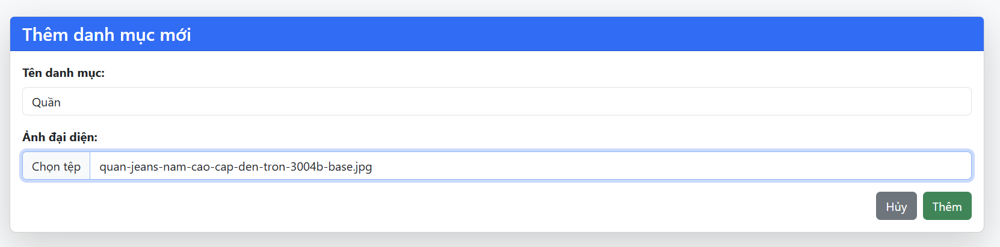

# LTWeb
## Bài tập 1,2,3 được hoàn thành trong project BTC3
### Bài tập 1
1.1 Session 
 
1.2 Cookies
 
 
Tại trang login, khi người dùng tick vào ô nhớ tôi thì cookies sẽ được lưu
### Bài tập 2
2.1 Login 

2.2 Register 

### Bài tập 3
3.1 ForgetPassword (dùng gmail), Logout 
 

3.2 CRUD Category 
3.2.1 Lấy dữ liệu từ DB 
 
3.2.2 Thêm 
 
3.2.3 Sửa 
 

